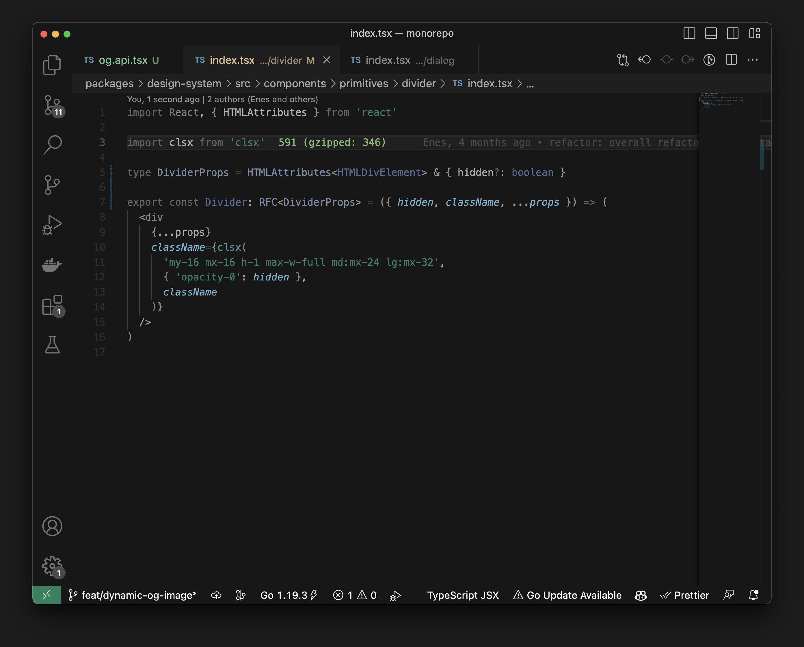

# Myrteal

Dark theme with Myrtle and Teal colors for VS Code by [Enes](https://twitter.com/enesozt_).

### Features

- Eye friendly. Low color details for unnecessary keywords, variables, operators, etc.
- React, TypeScript, and JavaScript focused. (Can be used for other languages but might need to be optimized.)

## Screenshots

## Feedbacks

Reach [@enesozt\_](https://twitter.com/enesozt_)
